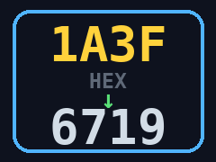

# AnberHex

**Konwerter systemów liczbowych w kieszeni.** SDL2-owa aplikacja dla **Anbernic RG40XX V**, która przelicza liczby między systemem **szesnastkowym (HEX, base-16)** a **dziesiętnym (DEC, base-10)** — i z powrotem. Dodatkowo pokazuje zapis **dwójkowy (BIN)** i **ósemkowy (OCT)**. Pełnoekranowa, sterowana padem konsoli, bez potrzeby klawiatury.



## Możliwości

- Konwersja **HEX → DEC** oraz **DEC → HEX** (przełączana jednym przyciskiem)
- Równoległy podgląd wyniku w **DEC / HEX / BIN / OCT**
- **Panel „DZIAŁANIE"** — pełny zapis przeliczenia krok po kroku:
  - HEX→DEC: rozwinięcie pozycyjne (potęgowanie · mnożenie · dodawanie), np. `1·16^3 + A·16^2 + 3·16^1 + F·16^0 = 4096 + 2560 + 48 + 15 = 6719`
  - DEC→HEX: kolejne dzielenie z resztą, reszty czytane od dołu
- Czytelne grupowanie cyfr (dziesiętne co 3, szesnastkowe i dwójkowe co 4)
- Ekranowa klawiatura cyfr sterowana D-padem — **klawiatura niepotrzebna**
- Renderowanie SDL2 + PIL (działa wprost na DRM/KMS, bez X11)
- Integracja z App Center (`dmenu.bin`) — ikona w siatce aplikacji
- POWER wygasza ekran bez zamykania apki

## Sterowanie

| Przycisk        | Akcja                                   |
|-----------------|-----------------------------------------|
| D-pad ←/→/↑/↓   | ruch po klawiaturze cyfr (podświetlenie)|
| **A** / START   | wstaw podświetloną cyfrę                |
| **B**           | skasuj ostatnią cyfrę (backspace)       |
| **Y**           | wyczyść całość                          |
| **X**           | przełącz kierunek (HEX→DEC / DEC→HEX)    |
| **MENU**        | wyjście                                 |
| **POWER**       | ekran off/on (apka działa dalej)        |

## Wymagania

- **Anbernic RG40XX V** (Allwinner H700, 640×480 LCD landscape)
- Python 3 z `pysdl2`, `Pillow`, `evdev`
- `PYSDL2_DLL_PATH=/usr/lib` (ustawiane przez launcher)

## Instalacja

Na konsoli (przez SSH lub terminal), jako root:

```bash
git clone https://github.com/karolfurtak/AnberHex.git
cd AnberHex
bash scripts/install.sh
```

Następnie uruchom **AnberHex** z App Center.

## Jak to działa

Wejście budujesz cyframi z ekranowej klawiatury (w trybie HEX dostępne `0–9 A–F`,
w trybie DEC tylko `0–9`). Wartość jest na bieżąco parsowana w wybranej bazie i
prezentowana równolegle we wszystkich czterech systemach. Logika konwersji jest
oddzielona od GUI i ma wbudowany self-test:

```bash
python3 app/main.py --selftest
```

## Licencja

MIT — © 2026 Karol Furtak. Zobacz [LICENSE](LICENSE).

---

Część rodziny narzędzi **Anber\*** dla RG40XX V:
[AnberMon](https://github.com/karolfurtak/AnberMon) ·
[AnberCC](https://github.com/karolfurtak/AnberCC) ·
[AnberNet](https://github.com/karolfurtak/AnberNet)
